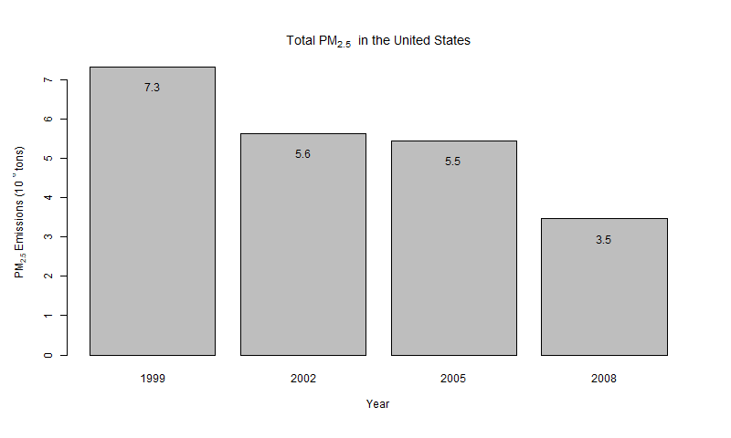
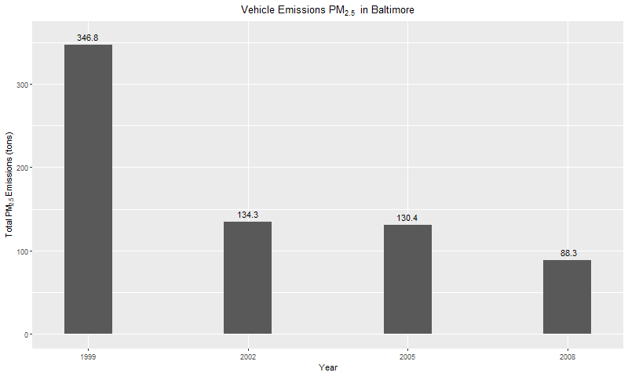
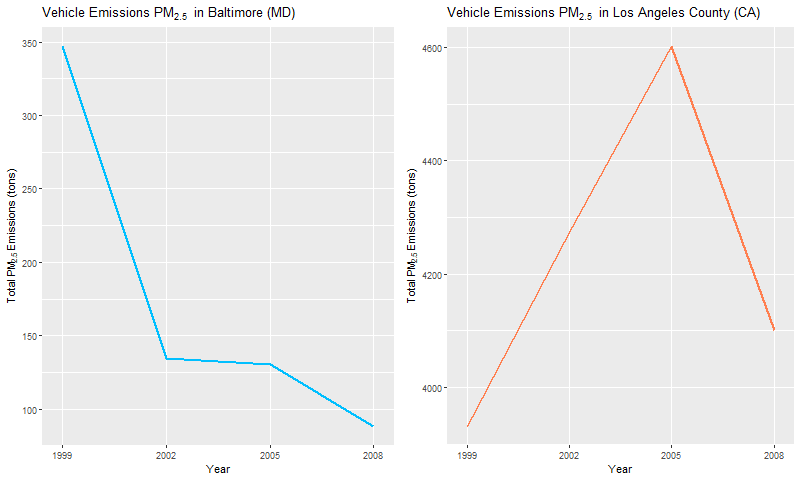

```{r setup, include=FALSE,message=FALSE,warning=FALSE,cache=TRUE}
# Defining document chunks options
knitr::opts_chunk$set(echo = TRUE,cache=TRUE,message=FALSE,warning=FALSE)

# Loading required libraries
library(rmarkdown)
library(lubridate)
library(ggplot2)
```

`r if(!knitr::is_html_output()) {sprintf(fmt = "* &#x1f468;&#x1F3FB;&#x200d;&#x1f4bb; Author: %s", params$author)}`
* `r sprintf(fmt = "&#x1f4da; Specialization: [%s](%s){target='_blank' rel='noopener'}", params$specialization, params$specialization_url)`
* `r sprintf(fmt = "&#x1f4d6; Course: [%s](%s){target='_blank' rel='noopener'}", params$course, params$course_url)`
    * `r sprintf(fmt = "&#x1F9D1;&#x200d;&#x1F3EB; Instructor: %s", params$instructor)`
* `r sprintf(fmt = "&#x1F4C6; %s", params$week)`
    * `r sprintf(fmt = "&#x1F6A6; Start: %s", format(params$course_start, "%A, %d %B %Y"))`
    * `r sprintf(fmt = "&#x1F3C1; Finish: %s", format(params$course_finish, "%A, %d %B %Y"))`
`r if(!knitr::is_html_output()) {sprintf(fmt = "* &#x1F30E; Rpubs: [Interactive Document](%s)", params$rpubs)}else{sprintf(fmt = "* &#x1F4E6; Github Repository: [Static Document](%s){target='_blank' rel='noopener'}", params$project_repo)}`

--------------------------------------------------------------------------------

## Sinopsis

Course Project 2 aims to create six plots using base `graphic` and `ggplot2` to answer six given questions. The datasets used for this assignment are from the National Emissions Inventory (NEI), which is recorded every three years. The current Course Project will cover the years from 1999 to 2008. The datasets comprise 2 data frames:

i. The `summarySCC_PM25.rds` with almost 6.5 million observations and 6 variables, and;
ii. The `Source_Classification_Code.rds` with over 11,7 thousand observations and 15 variables.

Based on the plots created to address the questions, I have figured out that PM2.5 emissions have decreased over the years all over the US. Although, In Baltimore City, it is clear the pollution emission reduction from vehicles, in Los Angeles County, the PM2.5 from vehicles had increased until 2005 when in 2008 the pollution decreased by almost 9%.

Finally, the Coal PM2.5 is mostly from Electric Generation, and one observed a sharp reduction in Coal PM2.5 between 2005 and 2008.

Feel free to look at the [Codebook]`r if(knitr::is_html_output()){sprintf(fmt="(%s){target='_blank' rel='noopener'}",params$codebook)}else{"(./codebook)"}` to go in-depth.

--------------------------------------------------------------------------------

## 1. Project Course 2 Assignment

Project Course 2 consists of answering six questions. Each question assignment asks to create a single plot to answer it.

#### Plot 1

> Question 1: Have total emissions from PM2.5 decreased in the United States from 1999 to 2008?

Using the **base** plotting system, make a plot showing the *total* PM2.5 emission from all sources for each of the years 1999, 2002, 2005, and 2008.

```{r plot-1,cache=TRUE,message=FALSE,warning=FALSE,echo=TRUE}
########################### Libraries Requirements #############################

library(magrittr)
library(tidyverse)

########################### 1. Creating a folder ###############################

# 1. Create a data directory
if(!base::file.exists("data")) {
    base::dir.create("data")
}

########################### 2. Downloading data ################################

# 2. Download files and store it in data directory.
if(!base::file.exists("./data/FNEI_data.zip")){
    utils::download.file(url = "https://d396qusza40orc.cloudfront.net/exdata%2Fdata%2FNEI_data.zip",
                         destfile = "./data/FNEI_data.zip")
}

# 2.1. Unzipping the FNEI_data.zip file.
if(!base::file.exists("./data/unzipped/Source_Classification_Code.rds") | !base::file.exists("./data/unzipped/summarySCC_PM25.rds")){
    utils::unzip(zipfile = "./data/FNEI_data.zip",
                 exdir = "./data/unzipped/",
                 list = FALSE,
                 overwrite = TRUE)
}

########################### 3. Loading RDS files ###############################

# 3. Loading the RDS files.
NEI <- base::readRDS("./data/unzipped/summarySCC_PM25.rds")
SCC <- base::readRDS("./data/unzipped/Source_Classification_Code.rds")

########################### 4. Dataset Manipulation ############################
# 4.1. Creating a subsetting to plot 1.
#plot_1_data <- base::with(data = NEI,
#                          base::tapply(X = Emissions, # The tapply will create
#                                       INDEX = year,  # a total emissions of
#                                       FUN = sum))    # each year.

# The above code has the same results of:
plot_1_data <- NEI %>%
     dplyr::group_by(year) %>%
     dplyr::summarise(total = base::sum(Emissions))

########################### 5. Plot 1 ##########################################

# 5.1. Defining the plot_1_data as data of the graph.
base::with(data = plot_1_data, {
    
    # 5.1.1. Creating a PNG file.
    grDevices::png(filename = "plot1.png", height = 480, width = 800)  
    
        # 5.1.1.1. Add a outer margin to the plot.
        par(oma = c(1,1,1,1))
        
        # 5.1.1.2. Creating the barchart plotting using base graphic system.
        p <- graphics::barplot(height = total/1000000, name = year, # Re-scaling to million.
                                
                               # Adding title.
                               main = base::expression('Total PM'[2.5] ~ ' in the United States'),
                     
                               # Adding y-axis label.
                               ylab = base::expression('PM'[2.5] ~ 'Emissions (10' ^6 ~ 'tons)'),
                                
                               # Adding x-axis label.
                               xlab = "Year");
        
        # 5.1.1.3. Adding text over the bars.
        text(x = p,
             y = total/1000000 - 0.5,            # Re-scaling to million.
             label = format(total/1000000, # Re-scaling to million.
                                            nsmall = 1,          # Rounding the number.
                                            digits = 1))
    
    # 5.1.2. Closing the device.
    grDevices::dev.off()      
})
```



Over the years, the fine particulate matter, the so-called PM2.5, has decreased from 7.3 million tons to 3.5 million tons, representing a 52.7% reduction.

#### Plot 2

> Question 2: Have total emissions from PM2.5 decreased in the **Baltimore City**, Maryland (`fips == "24510"`) from 1999 to 2008?

Use the **base** plotting system to make a plot answering this question.

```{r plot-2,cache=TRUE,message=FALSE,warning=FALSE,echo=TRUE}
########################### Libraries Requirements #############################

library(magrittr)
library(tidyverse)

########################### 1. Creating a folder ###############################

# 1. Create a data directory
if(!base::file.exists("data")) {
    base::dir.create("data")
}

########################### 2. Downloading data ################################

# 2. Download files and store it in data directory.
if(!base::file.exists("./data/FNEI_data.zip")){
    utils::download.file(url = "https://d396qusza40orc.cloudfront.net/exdata%2Fdata%2FNEI_data.zip",
                         destfile = "./data/FNEI_data.zip")
}

# 2.1. Unzipping the FNEI_data.zip file.
if(!base::file.exists("./data/unzipped/Source_Classification_Code.rds") | !base::file.exists("./data/unzipped/summarySCC_PM25.rds")){
    utils::unzip(zipfile = "./data/FNEI_data.zip",
                 exdir = "./data/unzipped/",
                 list = FALSE,
                 overwrite = TRUE)
}

########################### 3. Loading RDS files ###############################

# 3. Loading the RDS files.
NEI <- base::readRDS("./data/unzipped/summarySCC_PM25.rds")
SCC <- base::readRDS("./data/unzipped/Source_Classification_Code.rds")

########################### 4. Dataset Manipulation ############################

# 4.1. Creating a subsetting for Baltimore City.
NEI_q2 <- base::subset(x = NEI, NEI$fips == "24510")

# 4.2. Summarizing the data set to calculate the total summation.
plot_2_data <- NEI_q2 %>%
    dplyr::group_by(year) %>%
    dplyr::summarise(total = base::sum(Emissions))

########################### 5. Plot 2 ##########################################

# 5.1. Defining the plot_1_data as data of the graph.
base::with(data = plot_2_data, {
    
    # 5.1.1. Creating a PNG file.
    grDevices::png(filename = "plot2.png", height = 480, width = 800)  
    
        # 5.1.1.1. Add a outer margin to the plot.
        par(oma = c(1,1,1,1))
        
        # 5.1.1.2. Creating the barchart plotting using base graphic system.
        p <- graphics::barplot(height = total, name = year,
                                
                               # Adding title.
                               main = base::expression('Total PM'[2.5] ~ ' in Baltimore City'),
                                
                               # Adding y-axis label.
                               ylab = base::expression('PM'[2.5] ~ 'Emissions (tons)'),
                                
                               # Adding x-axis label.
                               xlab = "Year")
        
        # 5.1.1.3. Adding text over the bars.
        graphics::text(x = p,
                       y = total - 100,
                       label = base::format(total,
                                            nsmall = 1,   # Rounding the number.
                                            digits = 1))
    
    # 5.1.2. Closing the device.
    grDevices::dev.off()      
})
```


Based on Plot 2, the fine particulate matter (PM2.5) decreased by 43.1% from 1999 to 2008. However, in 2005 the PM2.5 of Baltimore City surpassed the 2002 index, showing a disturbance in the trend of PM 2.5 decreasing.

#### Plot 3

> Question 3: Of the four types of sources indicated by the `type` (point, nonpoint, onroad, nonroad) variable, which of these four sources have seen decreases in emissions from 1999–2008 for **Baltimore City**? Which have seen increases in emissions from 1999–2008?

Use the **ggplot2** plotting system to make a plot answer this question.

```{r plot-3,cache=TRUE,message=FALSE,warning=FALSE,echo=TRUE}
########################### Libraries Requirements #############################

library(ggplot2)
library(magrittr)
library(tidyverse)

########################### 1. Creating a folder ###############################

# 1. Create a data directory
if(!base::file.exists("data")) {
    base::dir.create("data")
}

########################### 2. Downloading data ################################

# 2. Download files and store it in data directory.
if(!base::file.exists("./data/FNEI_data.zip")){
    utils::download.file(url = "https://d396qusza40orc.cloudfront.net/exdata%2Fdata%2FNEI_data.zip",
                         destfile = "./data/FNEI_data.zip")
}

# 2.1. Unzipping the FNEI_data.zip file.
if(!base::file.exists("./data/unzipped/Source_Classification_Code.rds") | !base::file.exists("./data/unzipped/summarySCC_PM25.rds")){
    utils::unzip(zipfile = "./data/FNEI_data.zip",
                 exdir = "./data/unzipped/",
                 list = FALSE,
                 overwrite = TRUE)
}

########################### 3. Loading RDS files ###############################

# 3. Loading the RDS files.
NEI <- base::readRDS("./data/unzipped/summarySCC_PM25.rds")
SCC <- base::readRDS("./data/unzipped/Source_Classification_Code.rds")

########################### 4. Dataset Manipulation ############################

# 4.1. Creating a subsetting for Baltimore City.
NEI_q3 <- base::subset(x = NEI, NEI$fips == "24510")

# 4.2. Summarizing the data set to calculate the total summation by year and type.
plot_3_data <- NEI_q3 %>%
    dplyr::group_by(type, year) %>%
    dplyr::summarise(Total = base::sum(Emissions))

#################################### 5. Plot 3  #######################################
# 5.1. Creating a PNG file.
grDevices::png(filename = "plot3.png", height = 480, width = 800)  

    # Plotting a GGPLOT2 graphic.
    ggplot2::ggplot(data = plot_3_data,
                    ggplot2::aes(x = year,
                                 y = Total,
                                 label = base::format(x = Total,
                                                      nsmall = 1,
                                                      digits = 1))) + 
        
    # Defining a line graphic.
    ggplot2::geom_line(ggplot2::aes(color = type), lwd = 1) + 
        
    # Adding labels to each point.
    ggplot2::geom_text(hjust = 0.5, vjust = 0.5) + 
        
    # Setting the years.
    ggplot2::scale_x_discrete(limits = c(1999, 2002, 2005, 2008)) +
        
    # Editing the Graphic Tile.
    ggplot2::labs(title = base::expression('Emissions of PM'[2.5] ~ ' in Baltimore')) +
        
    # Adding x-axis label.
    ggplot2::xlab("Year") + 
        
    # Adding y-axis label.
    ggplot2::ylab(base::expression("Total PM"[2.5] ~ "emission (tons)")) +
        
    # Editing the legend position and tile position.
    ggplot2::theme(legend.position = "right",
                   legend.title.align = 0.5,
                   plot.title = ggplot2::element_text(hjust = 0.5))

# Closing the device.
grDevices::dev.off()
```


According to the line graphic in Plot 3, `non-road`, `nonpoint`, and `on-road` types have decreased their emissions of PM2.5 between 1999 and 20008. On the other hand, the `point` type has increased by 16.2%.

#### Plot 4

> Question 4: Across the United States, how have emissions from coal combustion-related sources changed from 1999–2008?

```{r plot-4,cache=TRUE,message=FALSE,warning=FALSE,echo=TRUE}
########################### Libraries Requirements #############################

library(ggplot2)
library(magrittr)
library(tidyverse)

########################### 1. Creating a folder ###############################

# 1. Create a data directory
if(!base::file.exists("data")) {
    base::dir.create("data")
}

########################### 2. Downloading data ################################

# 2. Download files and store it in data directory.
if(!base::file.exists("./data/FNEI_data.zip")){
    utils::download.file(url = "https://d396qusza40orc.cloudfront.net/exdata%2Fdata%2FNEI_data.zip",
                         destfile = "./data/FNEI_data.zip")
}

# 2.1. Unzipping the FNEI_data.zip file.
if(!base::file.exists("./data/unzipped/Source_Classification_Code.rds") | !base::file.exists("./data/unzipped/summarySCC_PM25.rds")){
    utils::unzip(zipfile = "./data/FNEI_data.zip",
                 exdir = "./data/unzipped/",
                 list = FALSE,
                 overwrite = TRUE)
}

########################### 3. Loading RDS files ###############################

# 3. Loading the RDS files.
NEI <- base::readRDS("./data/unzipped/summarySCC_PM25.rds")
SCC <- base::readRDS("./data/unzipped/Source_Classification_Code.rds")

########################### 4. Dataset Manipulation ############################

# 4.1. Filtering the SCC cods from Coal.
SCC_list <- SCC %>% 
    dplyr::filter(base::grepl(x = EI.Sector,
                              pattern = "Coal|coal")) %>%
    dplyr::select(SCC, EI.Sector)

# 4.2. Filtering NEI dataset of Coal from a specific SCC list.
NEI_q4 <- base::subset(x = NEI, SCC %in% SCC_list$SCC)

# 4.3. Merging SCC_list and NEI_q4 to insert a column of EI.Sector on NEI dataset.
NEI_q4_v2 <- base::merge(NEI_q4, SCC_list)

# 4.4. Calculating the total summation and removing some patterns from EI.Sector column.
NEI_q4_v3 <- NEI_q4_v2 %>%
    dplyr::group_by(year, EI.Sector) %>%                                    # Grouping to summarize it by year and EI.Sector.
    dplyr::summarise(Total = base::sum(Emissions)) %>%                      # Calculating the Total column.
    dplyr::mutate(EI.Sector = base::gsub(pattern = "Fuel Comb - | - Coal",  # Removing some patterns from EI.Sector
                                         replacement =  "",                 # Cleaning the info from EI.Sector column.
                                         x = EI.Sector))

# 4.5. Auxiliary dataset to calculate the total of each bar.
NEI_q4_v3_total <- NEI_q4_v3 %>%
    dplyr::summarise(Total = base::sum(Total)/1000)

#################################### 5. Plot 4  #######################################

# 5.1. Exporting a PNG file. 
grDevices::png(filename = "plot4.png", height = 480, width = 800)

    # 5.1.1. Creating a ggplot2 graph.
    ggplot2::ggplot(data = NEI_q4_v3,
                    ggplot2::aes(x = year,
                                 y = Total/1000,       # Re-scaling to thousands.
                                 fill = EI.Sector)) +
        
        # Defining stacked bars.
        ggplot2::geom_bar(position = "stack", stat = "identity") + 
        
        # Adding labels with value over the bars.
        ggplot2::geom_text(data = NEI_q4_v3_total,
                           ggplot2::aes(x = year,
                                        label = base::format(x = Total,
                                                             nsmall = 1, digits = 1), # Rounding the number.
                                        y = Total,
                                        fill = NULL),
                           nudge_y = 10) + # Distance to the point.
        
        # Setting the years.
        ggplot2::scale_x_discrete(limits = c(1999, 2002, 2005, 2008)) +
        
        # Adding title
        ggplot2::labs(title = base::expression('Coal Combustion PM'[2.5] ~ ' in the United States')) + 
        
        # Adding x-axis label.
        ggplot2::xlab("Year") +
        
        # Adding y-axis label.
        ggplot2::ylab(base::expression('PM'[2.5] ~ 'Emissions (10' ^3 ~ 'tons)')) +
        
        # Editing the legend position and tile position.
        ggplot2::theme(legend.position = "bottom",
                       legend.title.align = 0.5,
                       plot.title = ggplot2::element_text(hjust = 0.5)) +
        
        # Removing the legend title.
        ggplot2::guides(fill = ggplot2::guide_legend(title = ""))

# 5.2. Closing the device.
grDevices::dev.off()
```


According to the SCC dataset, there are three sources of coal PM2.5 emissions:

* Fuel Comb - Comm/Institutional - Coal;
* Fuel Comb - Electric Generation - Coal, and;
* Fuel Comb - Industrial Boilers, ICEs - Coal.

The PM2.5 emissions from Coal have decreased by 37.9%, most resulting from a reduction in `Electric Generation` by 41,7% observed from 2005 to 2008. In addition, the `Comm/Institutional` also had an extraordinary evolution reducing 74.2% of its emissions in the same period. On the other hand, the `Industrial Boilers, ICEs` have increased their emissions by 34.3%, going in the opposite direction.

#### Plot 5

> Question 5: How have emissions from motor vehicle sources changed from 1999–2008 in **Baltimore City**?

```{r plot-5,cache=TRUE,message=FALSE,warning=FALSE,echo=TRUE}
########################### Libraries Requirements #############################

library(ggplot2)
library(magrittr)
library(tidyverse)

########################### 1. Creating a folder ###############################

# 1. Create a data directory
if(!base::file.exists("data")) {
    base::dir.create("data")
}

########################### 2. Downloading data ################################

# 2. Download files and store it in data directory.
if(!base::file.exists("./data/FNEI_data.zip")){
    utils::download.file(url = "https://d396qusza40orc.cloudfront.net/exdata%2Fdata%2FNEI_data.zip",
                         destfile = "./data/FNEI_data.zip")
}

# 2.1. Unzipping the FNEI_data.zip file.
if(!base::file.exists("./data/unzipped/Source_Classification_Code.rds") | !base::file.exists("./data/unzipped/summarySCC_PM25.rds")){
    utils::unzip(zipfile = "./data/FNEI_data.zip",
                 exdir = "./data/unzipped/",
                 list = FALSE,
                 overwrite = TRUE)
}

########################### 3. Loading RDS files ###############################

# 3. Loading the RDS files.
NEI <- base::readRDS("./data/unzipped/summarySCC_PM25.rds")
SCC <- base::readRDS("./data/unzipped/Source_Classification_Code.rds")

########################### 4. Dataset Manipulation ############################

# 4.1. Filtering NEI dataset of ON-ROAD from all sources.
NEI_q5 <- base::subset(x = NEI, NEI$fips=="24510" & NEI$type=="ON-ROAD")

# 4.2. Summarizing the dataset to aggregate Emissions into Total divided by year.
plot_5_data <- NEI_q5 %>%
    dplyr::group_by(year) %>%
    dplyr::summarise(Total = base::sum(Emissions))

########################### 5. Plot 5 ##########################################

# 5.1. Exporting a PNG file. 
grDevices::png(filename = "plot5.png", height = 480, width = 800)

    # 5.1.1. Creating a ggplot2 graph.
    ggplot2::ggplot(data = plot_5_data,
                    ggplot2::aes(x = year,
                                 y = Total)) +
        
        # Defining stacked bars.
        ggplot2::geom_bar(position = "stack",
                          stat = "identity") + 
        
        # Adding labels with value over the bars.
        ggplot2::geom_text(data = plot_5_data,
                           ggplot2::aes(x = year,
                                        label = base::format(x = Total,
                                                             nsmall = 1,digits = 1), # Rouding the values.
                                        y = Total,
                                        fill = NULL),
                           nudge_y = 10) + 
        
        # Setting the years.
        ggplot2::scale_x_discrete(limits = c(1999, 2002, 2005, 2008)) +

        # Adding title
        ggplot2::labs(title = base::expression('Vehicle Emissions PM'[2.5] ~ ' in Baltimore')) + 
        
        # Adding x-axis label.
        ggplot2::xlab("Year") + 
        
        # Adding y-axis label.
        ggplot2::ylab(base::expression('Total PM'[2.5] ~ 'Emissions (tons)')) +
        
        # Editing the legend position/align and title position.
        ggplot2::theme(legend.position = "bottom",
                       legend.title.align = 0.5,
                       plot.title = ggplot2::element_text(hjust = 0.5)) + 
        
        # Removing the legend title.
        ggplot2::guides(fill = ggplot2::guide_legend(title = "")) -> p5
    
    # Printing the ggplot2 graph.
    base::print(p5)

# 5.2. Closing the device.
grDevices::dev.off()
```



The Vehicle Emissions of PM2.5 decreased by 74.5% from 1999 to 2008. The most significant change occurred between 1999 and 2002.

#### Plot 6

> Question 6: Compare emissions from motor vehicle sources in Baltimore City with emissions from motor vehicle sources in **Los Angeles County**, California (`fips == "06037"`). Which city has seen greater changes over time in motor vehicle emissions?

```{r plot-6,cache=TRUE,message=FALSE,warning=FALSE,echo=TRUE}
########################### Libraries Requirements #############################

library(ggplot2)
library(magrittr)
library(tidyverse)
library(cowplot)

########################### 1. Creating a folder ###############################

# 1. Create a data directory
if(!base::file.exists("data")) {
    base::dir.create("data")
}

########################### 2. Downloading data ################################

# 2. Download files and store it in data directory.
if(!base::file.exists("./data/FNEI_data.zip")){
    utils::download.file(url = "https://d396qusza40orc.cloudfront.net/exdata%2Fdata%2FNEI_data.zip",
                         destfile = "./data/FNEI_data.zip")
}

# 2.1. Unzipping the FNEI_data.zip file.
if(!base::file.exists("./data/unzipped/Source_Classification_Code.rds") | !base::file.exists("./data/unzipped/summarySCC_PM25.rds")){
    utils::unzip(zipfile = "./data/FNEI_data.zip",
                 exdir = "./data/unzipped/",
                 list = FALSE,
                 overwrite = TRUE)
}

########################### 3. Loading RDS files ###############################

# 3. Loading the RDS files.
NEI <- base::readRDS("./data/unzipped/summarySCC_PM25.rds")
SCC <- base::readRDS("./data/unzipped/Source_Classification_Code.rds")

########################### 4. Dataset Manipulation ############################

# 4.1. Filtering NEI dataset of ON-ROAD type to select only Baltimore City and Los Angeles County observations.
NEI_q6 <- base::subset(x = NEI,
                       NEI$fips %in% c("24510","06037") & NEI$type == "ON-ROAD")

# 4.2. Creating a auxiliary dataset to store the infos: fips and city.
city_data <- base::data.frame(fips = c("24510","06037"),                    # First column
                              city = c("Baltimore, MD","Los Angeles, CA"))  # Second column

# 4.3. Merging NEI_q6 and city_data to create a new dataframe with a column of city. The city info
# will be used in the graph.
NEI_q6_v2 <- base::merge(NEI_q6, city_data)

# 4.4. Summarizing the dataset to aggregate Emissions into Total divided into year and city.
plot_6_data <- NEI_q6_v2 %>%
    dplyr::group_by(year, city) %>%
    dplyr::summarise(Total = base::sum(Emissions))

########################### 5. Plot 6 ##########################################

# 5.1. Exporting a PNG file. 
grDevices::png(filename = "plot6.png", height = 480, width = 800)

    # 5.1.2. Creating the first graph about Baltimore City Vehicle Emissions.
    p61 <- ggplot2::ggplot(data = plot_6_data %>% dplyr::filter(city == "Baltimore, MD"), # Filtering only data from Baltimore.
                           ggplot2::aes(x = year, y = Total)) + 
        
        # Defining a line plot, color and line width.
        ggplot2::geom_line(lwd = 1, color = "deepskyblue") + 
        
        # Adding title.
        ggplot2::labs(title = base::expression('Vehicle Emissions PM'[2.5] ~ ' in Baltimore (MD)')) +
        
        # Defining the tick marks on the x-axis.
        ggplot2::scale_x_discrete(limits = c(1999, 2002, 2005, 2008)) + 
        
        # Adding x-axis label.
        ggplot2::xlab("Year") + 
        
        # Adding y-axis label.
        ggplot2::ylab(base::expression('Total PM'[2.5] ~ 'Emissions (tons)'))

    # 5.1.2. Creating the first graph about Los Angeles County Vehicle Emissions.
    p62 <- ggplot2::ggplot(data = plot_6_data %>% dplyr::filter(city == "Los Angeles, CA"), # Filtering only data from Los Angeles County.
                           ggplot2::aes(x = year, y = Total)) +
        
        # Defining a line plot, color and line width.
        ggplot2::geom_line(lwd = 1, color = "coral") +
        
        # Adding title.
        ggplot2::labs(title = base::expression('Vehicle Emissions PM'[2.5] ~ ' in Los Angeles County (CA)')) +
        
        # Defining the tick marks on the x-axis.
        ggplot2::scale_x_discrete(limits = c(1999, 2002, 2005, 2008)) + 
        
        # Adding x-axis label.
        ggplot2::xlab("Year") + 
        
        # Adding y-axis label.
        ggplot2::ylab(base::expression('Total PM'[2.5] ~ 'Emissions (tons)'))

    # 5.1.3. Using the cowplot to bind graphs p1 and p2 into one.
    p612 <- cowplot::plot_grid(p61, p62, labels = "")
    
    # 5.1.4. Printing the cowplot.
    base::print(p612)

# 5.2. Closing the device.
grDevices::dev.off()
```



Baltimore City has decreased its PM2.5 emissions from the vehicle by 74.5%. However, in the opposite direction, Los Angeles has increased its PM 2.5 emissions by 4.3%.

Los Angeles did not significantly change its fine particulate matter emissions, but Baltimore has advanced a lot, showing the more substantial changes in PM2.5 emissions over time.