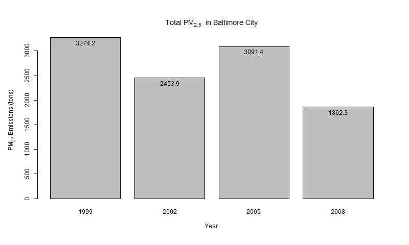
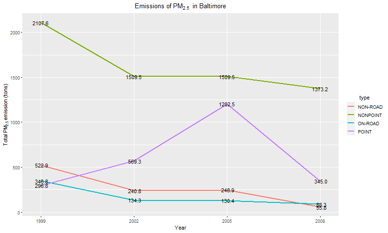
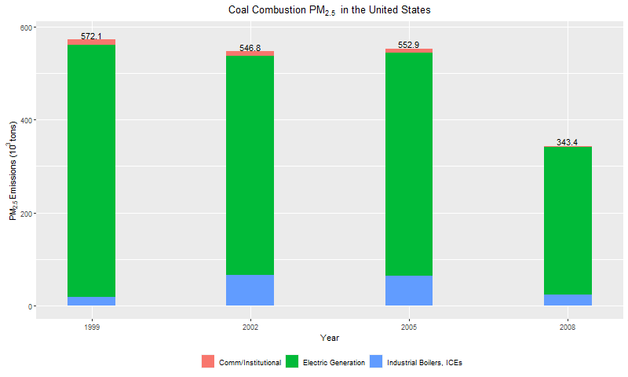

`Course Project 2` Exploratory Data Analysis
================

-   👨🏻‍💻 Author: Anderson H Uyekita
-   📚 Specialization: <a
    href="https://www.coursera.org/specializations/data-science-foundations-r"
    target="_blank" rel="noopener">Data Science: Foundations using R
    Specialization</a>
-   📖 Course:
    <a href="https://www.coursera.org/learn/exploratory-data-analysis"
    target="_blank" rel="noopener">Exploratory Data Analysis</a>
    -   🧑‍🏫 Instructor: Roger D Peng
-   📆 Week 4
    -   🚦 Start: Wednesday, 15 June 2022
    -   🏁 Finish: Sunday, 19 June 2022
-   🌎 Rpubs: [Interactive
    Document](https://rpubs.com/AndersonUyekita/course-project-2_exploratory-data-analysis)

------------------------------------------------------------------------

## Sinopsis

------------------------------------------------------------------------

## 1. Project Course 2 Assignment

Project Course 2 consists of answering six questions. Each question
assignment asks to create a single plot to answer it.

#### Plot 1

> Question 1: Have total emissions from PM2.5 decreased in the United
> States from 1999 to 2008?

Using the **base** plotting system, make a plot showing the *total*
PM2.5 emission from all sources for each of the years 1999, 2002, 2005,
and 2008.

Over the years, the fine particulate matter, the so-called PM2.5, has
decreased from 7.3 million tons to 3.5 million tons, representing a
52.7% reduction.

#### Plot 2

> Question 2: Have total emissions from PM2.5 decreased in the
> **Baltimore City**, Maryland (`fips == "24510"`) from 1999 to 2008?

Use the **base** plotting system to make a plot answering this question.

Based on Plot 2, the fine particulate matter (PM2.5) decreased by 43.1%
from 1999 to 2008. However, in 2005 the PM2.5 of Baltimore City
surpassed the 2002 index, showing a disturbance in the trend of PM 2.5
decreasing.

#### Plot 3

> Question 3: Of the four types of sources indicated by the `type`
> (point, nonpoint, onroad, nonroad) variable, which of these four
> sources have seen decreases in emissions from 1999–2008 for
> **Baltimore City**? Which have seen increases in emissions from
> 1999–2008?

Use the **ggplot2** plotting system to make a plot answer this question.

According to the line graphic in Plot 3, `non-road`, `nonpoint`, and
`on-road` types have decreased their emissions of PM2.5 between 1999 and
20008. On the other hand, the `point` type has increased by 16.2%.

#### Plot 4

> Question 4: Across the United States, how have emissions from coal
> combustion-related sources changed from 1999–2008?

According to the SCC dataset, there are three sources of coal PM2.5
emissions:

-   Fuel Comb - Comm/Institutional - Coal;
-   Fuel Comb - Electric Generation - Coal, and;
-   Fuel Comb - Industrial Boilers, ICEs - Coal.

The PM2.5 emissions from Coal have decreased by 37.9%, most resulting
from a reduction in `Electric Generation` by 41,7% observed from 2005 to
2008. In addition, the `Comm/Institutional` also had an extraordinary
evolution reducing 74.2% of its emissions in the same period. On the
other hand, the `Industrial Boilers, ICEs` have increased their
emissions by 34.3%, going in the opposite direction.

#### Plot 5

> Question 5: How have emissions from motor vehicle sources changed from
> 1999–2008 in **Baltimore City**?

The Vehicle Emissions of PM2.5 decreased by 74.5% from 1999 to 2008. The
most significant change occurred between 1999 and 2002.

#### Plot 6

> Question 6: Compare emissions from motor vehicle sources in Baltimore
> City with emissions from motor vehicle sources in **Los Angeles
> County**, California (`fips == "06037"`). Which city has seen greater
> changes over time in motor vehicle emissions?

Baltimore City has decreased its PM2.5 emissions from the vehicle by
74.5%. However, in the opposite direction, Los Angeles has increased its
PM 2.5 emissions by 4.3%.

Los Angeles did not significantly change its fine particulate matter
emissions, but Baltimore has advanced a lot, showing the more
substantial changes in PM2.5 emissions over time.

## 2.
